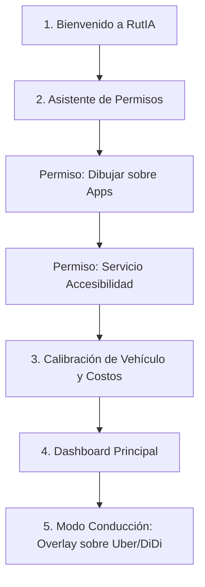

# Especificación de Producto (Product Spec) & Roadmap V1: RutIA

---

## 1. Visión General de la V1 (MVP)

**RutIA** es el asistente copiloto inteligente impulsado por IA para conductores de aplicaciones de transporte (Uber, DiDi, inDrive) en Colombia y Latinoamérica. 

El objetivo de la **V1** es garantizar una experiencia impecable en la funcionalidad **CORE**: analizar cada solicitud de viaje en tiempo real, mostrar el **Semáforo de Rentabilidad Neta** sin distraer al conductor y brindar un **Resumen Financiero Diario con IA** al cerrar el turno.

---

## 2. Flujo de Usuario Detallado (User Flow & Onboarding)

El proceso de registro e inicio de uso debe tomar **menos de 2 minutos** y generar absoluta confianza con los permisos delicados de Android.



---

### 📱 PANTALLA 1: Bienvenida & Propuesta de Valor (Splash / Welcome)
* **Visual**: Logo oficial de **RutIA** en modo oscuro, con acentos en verde esmeralda neón.
* **Mensaje**: *"Conduce más inteligente, no más horas. Calcula tu ganancia neta en tiempo real."*
* **Acción**: Botón principal **"Empezar a Ganar Más"** / "Continuar con Google".

---

### 🛡️ PANTALLA 2: Asistente de Permisos Guiado (Wizard de Permisos)
> ⚠️ *Punto Crítico*: Android exige explicaciones claras antes de solicitar permisos de Accesibilidad y Ventana Flotante para evitar rechazos en Google Play Store.

1. **Permiso 1: Ventana Flotante (Overlay)**
   * **Explicación al usuario**: *"Necesitamos este permiso para mostrarte la burbuja inteligente con el semáforo sobre Uber y DiDi sin que tengas que cambiar de aplicación."*
   * **Botón**: "Activar Permiso de Pantalla" (Abre los ajustes de Android directamente).
2. **Permiso 2: Servicio de Accesibilidad**
   * **Explicación al usuario**: *"RutIA lee automáticamente la tarifa y la distancia que aparece en tu pantalla para calcular si el viaje te deja ganancia real. No guardamos información personal."*
   * **Botón**: "Activar Accesibilidad de RutIA" (Guía con una animación simple mostrando en qué opción de Android hacer clic).

---

### ⚙️ PANTALLA 3: Calibración de Vehículo y Costos Operativos
Formulario simple de 3 pasos para ajustar las matemáticas de rentabilidad:

1. **Tipo de Vehículo**:
   * 🚗 Carro (Gasolina / Gas GNV / Eléctrico)
   * 🛵 Moto
2. **Eficiencia & Costo del Combustible**:
   * *Consumo estimado*: Ej: 40 km por galón (con sugerencias automáticas según el carro).
   * *Precio del galón*: Pre-llenado automáticamente según el promedio nacional (ej. $15.500 COP), editable por el usuario.
3. **Tus Metas Financieras**:
   * *Meta de ganancia por Kilómetro*: Ej. Mínimo $2.500 COP/km.
   * *Meta de ganancia por Hora*: Ej. Mínimo $30.000 COP/hora.

---

### 🏠 PANTALLA 4: Dashboard Principal (Inicio)
Una interfaz limpia en modo oscuro donde el conductor controla su jornada:

* **Switch Principal Gigante**: **[ 🟢 RUTIA ACTIVO / 🔴 INACTIVO ]**
* **Resumen de Hoy**:
  * Viajes analizados: `24`
  * Viajes rentables aceptados: `14`
  * Ganancia Neta Estimada hoy: `$142.500 COP`
* **Acceso Rápido**:
  * Configuración de vehículo.
  * Activar/Desactivar Copiloto de Voz (Text-to-Speech).
  * Botón **"Cerrar Turno y Ver Reporte IA"**.

---

### 🚗 PANTALLA 5: Modo Conducción (Overlay Flotante en Vivo)
Cuando entra una solicitud en Uber, DiDi o inDrive, aparece la **Burbuja Flotante de RutIA** en la esquina de la pantalla:

```
┌────────────────────────────────────────────────────────┐
│ 🟢 VIAJE MUY RENTABLE (RutIA)                   [ X ] │
├────────────────────────────────────────────────────────┤
│ 💰 Ganancia Neta:   +$14.200 COP                      │
│ 📏 Valor por Km:     $3.800 COP / km                  │
│ ⏱️ Valor por Hora:   $42.000 COP / hr                 │
├────────────────────────────────────────────────────────┤
│ 🗣️ Copiloto de Voz: "Viaje de $18k. Muy Rentable."    │
└────────────────────────────────────────────────────────┘
```

---

## 3. Funcionalidades CORE de la V1 (Must-Have)

| Módulo | Descripción Funcional | Tecnología |
| :--- | :--- | :--- |
| **Lector UI de Pantalla** | Lee en <50ms la tarifa, distancia y tiempo de Uber, DiDi e inDrive. | Kotlin `AccessibilityService` |
| **Burbuja Flotante** | Widget semitransparente interactivo sobre la app de transporte. | Kotlin `WindowManager` |
| **Motor de Cálculo** | Resta el costo de combustible estimado y evalúa contra las metas. | Algoritmo local en Kotlin |
| **Copiloto de Voz** | Dicta en voz alta el veredicto del viaje por altavoz o audífono Bluetooth. | Android `TextToSpeech` (Nativo) |
| **Base de Datos & Auth** | Registro de usuario, configuración de vehículo y log de viajes. | Supabase (Postgres + Auth) |
| **Coach Financiero IA** | Reporte diario en lenguaje natural generado al cerrar el turno. | Supabase Edge Function + Claude API |

---

## 4. Roadmap de Desarrollo V1 (Cronograma de 8 Semanas)

### 🗓️ SEMANAS 1 - 2: Fundación y Motor Core (Accesibilidad & Overlay)
* [ ] Crear el proyecto Android Kotlin con la arquitectura limpia.
* [ ] Desarrollar el `AccessibilityService` para captura de nodos de texto de Uber y DiDi.
* [ ] Crear el widget flotante `WindowManager` (Overlay).
* [ ] Conectar la lectura de la pantalla con la actualización del Overlay.

### 🗓️ SEMANAS 3 - 4: Motor de Cálculo, UI & Copiloto de Voz
* [ ] Desarrollar la pantalla de Calibración de Vehículo y Costos.
* [ ] Programar el motor de cálculo de Semáforo (Verde, Amarillo, Rojo).
* [ ] Integrar Android `TextToSpeech` nativo para la respuesta por voz sin manos.
* [ ] Diseñar las pantallas de Onboarding con los colores y la marca **RutIA**.

### 🗓️ SEMANAS 5 - 6: Integración con Supabase & Coach Financiero IA
* [ ] Configurar el proyecto en **Supabase** (Tablas: `profiles`, `trips`, `app_config`).
* [ ] Conectar la autenticación y sincronización del histórico de viajes.
* [ ] Crear la Supabase Edge Function para el **Coach Financiero IA** de cierre de turno.
* [ ] Implementar la lectura y recomendación para **inDrive**.

### 🗓️ SEMANAS 7 - 8: Beta Cerrada, QA y Publicación en Google Play
* [ ] Pruebas de campo con 20 conductores reales en celular Android físico.
* [ ] Optimización de consumo de batería y memoria RAM.
* [ ] Crear la web de Políticas de Privacidad.
* [ ] Subir la versión Beta a **Google Play Console** ($25 USD) para revisión y publicación.
